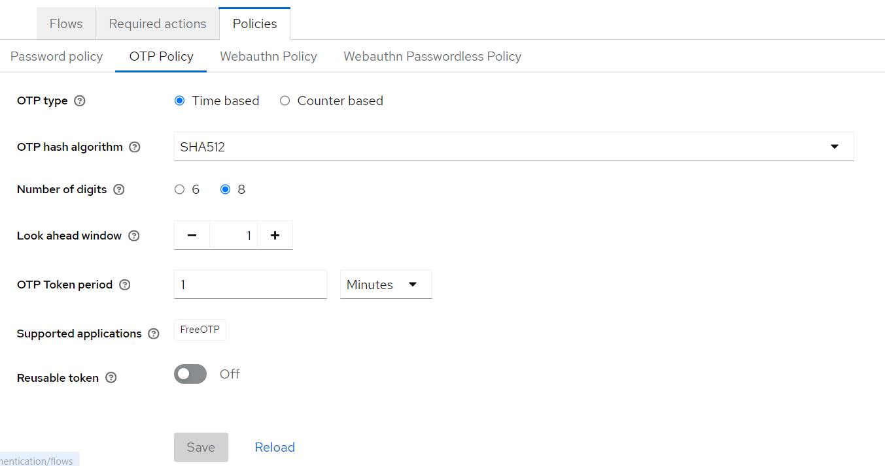
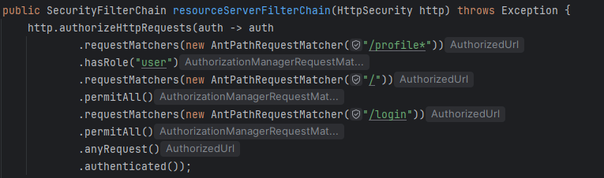

# Keycloak

### O que é?
Keycloak é uma ferramenta de código aberto para gestão de identidades e acessos (Identity and Access Management, IAM). Desenvolvida pela Red Hat, esta solução facilita a autenticação e autorização de aplicações modernas, seja para ambientes on-premise ou em nuvem. 
Aqui estão as principais funcionalidades do Keycloak:

1.  Single Sign-On (SSO):
    *   Permite que os utilizadores façam login uma vez e acessem múltiplas aplicações sem precisar reinserir credenciais.

2.  Gestão de Utilizadores:
    *   Criação, modificação e remoção de utilizadores.
    *   Suporta grupos e funções de utilizadores.
    *   Integração com diretórios de utilizadores como LDAP e Active Directory.

3.  Autenticação e Autorização:
    *   Suporte para diferentes métodos de autenticação, incluindo multifatorial (MFA).
Gestão de permissões baseada em papéis (RBAC - Role-Based Access Control).

4.  Federation:
    *   Integração com outros provedores de identidade (IdPs) como SAML 2.0, OpenID Connect, e OAuth 2.0.
    *   Permite a utilização de credenciais de serviços externos como Google, Facebook, GitHub, etc.

5.  Configuração e Personalização:
    *   Interfaces de administração para configurar e gerir todos os aspectos do sistema.
    *   Personalização das páginas de login e outras interfaces para alinhar com a identidade visual da organização.

Devido a estas funcionalidades anteriores, decidiu-se implementar a ferramenta Keycloak como forma de autenticação.

## Implementação

O keycloak foi instalado num container recorrendo a um [Docker Compose](../../Code/BE/KeycloakConfigs/docker-compose.yml) que monta 3 containers, um para o keycloak, outro para a base de dados Postgre que irá guardar os dados, e o redis para a cache.

Após levantar os containers, é só ir à porta 9090 e fazer as configurações necessárias.
As configurações que estão implementadas de momento foram exportadas para um ficheiro JSON, que pode ser encontrado [aqui](../../Code/BE/KeycloakConfigs/realm-jndesofs-export-v2.json).

## Requisitos de Segurança

### Autenticação Segura

Garantir que o sistema de autenticação seja robusto e seguro, incluindo senhas fortes, 2FA, políticas de bloqueio de conta.

| ASVS Level | CWE Code | Correção | Prova |
|------------|----------|----------|----------| 
| Nível 1    | CWE-620  | Utilização de autenticação multifator (2FA) |  |
| Nível 2    | CWE-521  | Políticas de senhas fortes ||
| Nível 3    | CWE-308  | Bloqueio de contas após tentativas falhadas |  |
|            | CWE-307  | Implementação de bloqueio de contas |  |
|            | CWE-304  | Reforço de autenticação multifator |            |
|            | CWE-303  | Verificação de autenticadores |  |
|            | CWE-640  | Armazenamento seguro de credenciais |   https://www.keycloak.org/docs/latest/server_admin/#password-database-compromised|
|            | CWE-287  | Autenticação robusta de utilizadores |   | 
|            | CWE-522  | Proteção das credenciais durante a transmissão |

**Com o Keycloak**: Keycloak fornece autenticação multifator (2FA), políticas de senhas, e bloqueio de contas após tentativas falhadas.

---

### Controlo de Acesso Adequado

Garantir que os utilizadores tenham acesso apenas às áreas e funcionalidades necessárias, com um sistema de controlo de acesso robusto.

| ASVS Level | CWE Code | Correção | Prova |
|------------|----------|----------|----------| 
| Nível 1    | CWE-602  | Definição de permissões detalhadas |
| Nível 2    | CWE-639  | Atribuição de roles específicos |  |
|            | CWE-285  | Implementação de controlo de acesso baseado em roles | Dependendo da role acima, é possivel decidir paginas / conteudo a exibir para cada role. |
|            | CWE-352  | Prevenção de ataques Cross-Site Request Forgery (CSRF) |  https://www.keycloak.org/docs/latest/server_admin/#csrf-attacks|
|            | CWE-419  | Verificação de acesso adequado |
|            | CWE-548  | Proteção de funcionalidades sensíveis |

**Com o Keycloak**: Keycloak permite definir permissões detalhadas e atribuição de roles, garantindo acesso adequado e controlado.

---

### Gestão de Sessão Segura

Gerir sessões de utilizador de forma segura, com a utilização de cookies seguros, tokens CSRF e expiração de sessão adequada.

| ASVS Level | CWE Code | Correção | Prova |
|------------|----------|----------|----------| 
| Nível 1    | CWE-598  | Utilização de cookies seguros |
|            | CWE-384  | Implementação de binding de sessão |
|            | CWE-331  | Geração de tokens seguros |
|            | CWE-539  | Configuração de expiração de sessão |
|            | CWE-613  | Prevenção de fixação de sessão |
|            | CWE-614  | Proteção de cookies contra ataque de rede |
|            | CWE-1004 | Verificação de tokens |
|            | CWE-16   | Gestão segura de sessões |
|            | CWE-778  | Defesas contra exploits de gestão de sessão |

**Com o Keycloak**: Keycloak utiliza cookies seguros, suporta tokens CSRF, e permite configuração de tempos de expiração de sessão.

---

### Tratamento de Erro e Logging

Implementação de um sistema de tratamento de erros e logging adequado, de forma a não expor informação que o utilizador não deva ter acesso.

| ASVS Level | CWE Code | Correção | Prova |
|------------|----------|----------|----------| 
| Nível 1    | CWE-532  | Implementação de logging seguro |            | 
| Nível 2    | CWE-778  | Prevenção de exploits através de logs |            | 
|            | CWE-285  | Acesso controlado a logs |            | 
|            | CWE-117  | Sanitização de mensagens de erro |            | 
|            | CWE-200  | Evitar a exposição de informações sensíveis |            | 
|            | CWE-210  | Proteção de logs contra acessos não autorizados |            | 
|            | CWE-544  | Configuração de políticas de retenção de logs |            | 
|            | CWE-431  | Gestão segura de erros e exceções |            | 

**Com o Keycloak**: Keycloak possui logging detalhado com opções de configuração para evitar a exposição de informações sensíveis.
