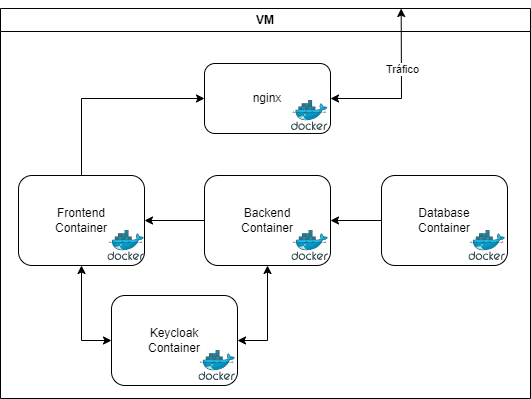

# Infraestrutura

## Design

De forma a manter todas as comunicações de forma privada para cumprir requisitos de segurança, foi adotada a estrutura demonstrada na imagem. É constituida por uma Máquina Virtual (VM), na qual estão presentes todos os containers e uma Reverse Proxy. 

### VM

A VM está configurada para apenas permitir tráfico através da porta que a Reverse Proxy está à escuta.

### Nginx

Esta VM contém uma Reverse Proxy, o Nginx. O objetivo do Nginx é permitir que o utilizador apenas consiga aceder o Frontend, tendo apenas acesso ao que é permitido pelas configurações do Nginx.

### Containers

