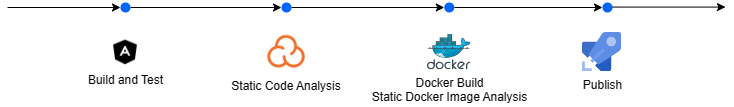

# Continous Integration

## Design FE e BE pipelines

Na seguinte imagem, é clarificado o processo da pipeline, quer seja do frontend quer do backend.

- Inicialmente é realizado um job de ```Build & Test``` do código.
- De seguida é realizada uma análise estática ao código de forma a serem identificadas vulnerabilidades e assegurar a qualidade no código.
- Após ser válido, é realizado a build da image de Docker
- Após o build da imagem, é utilizada a ferramenta ```Docker Scout``` para realizar uma análise à imagem para tentar detetar vulnerabilidades de segurança e falhas em configurações.
- Por fim, é realizado o ```Deployment```



## Dependabot

Enquanto as pipelines previamente referidas são triggered a cada commit se alguma mudança no respetivo código for realizado (e.g. para o frontend na pasta ./Code/FE/), foi ainda implementada outra ferramenta de forma a manter todas as dependências atualizadas, Dependabot.

É uma tool criada pelo Github que dependendo das configurações, cria Pulll Requests com atualizações, envia notificações, entre outros.
Decidimos utilizá-la uma vez que adiciona mais uma camada de segurança à nossa aplicação.