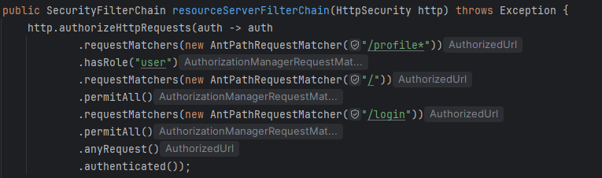

# Requisitos de Segurança

## Arquitetura, Design e Ameaça

| ASVS Level | CWE Code | Componente | Correção | Prova |
|------------|----------|----------|----------|----------|
| Nível 2 | CWE-250  | ContinousIntegration | Implementação do Docker Scout verifica a utilização de privilégio em operações que podem ser exploradas |  |
| Nível 2 | CWE-284  | ContinousIntegration | Implementação do Docker Scout deteta problemas em controlo de acessos nos componentes da imagem Docker |  |
| Nível 2 | CWE-284  | ContinousIntegration | Build da imagem Docker verifica que as imagens não utilizam demasiadas permissões |  |
| Nível 2 | CWE-284 | Infrastructure | Restrição de tráfego a portas especificas e serviços, reduz o acesso não autorizado | |
| Nível 2 | CWE-306 | Infrastructure | Apenas ser possível aceder o backend através do frontend com autenticação apropriada | |
| Nível 2 | CWE-502  | ContinousIntegration | Implementação do Sonar Cloud |  |
| Nível 2 | CWE-1104  | ContinousIntegration | Implementação de Sonar Cloud e Docker Scout enviam relatórios e avisos sobre componentes e o Dependabot deteta dependências inválidas e cria PRs |  |

## Autenticação Segura

| ASVS Level | CWE Code | Componente | Correção | Prova |
|------------|----------|----------|----------|----------|
| Nível 1 | CWE-287 | Authentication | Autenticação robusta de utilizadores |   | 
| Nível 1 | CWE-303 | Authentication | Verificação de autenticadores |  |
| Nível 1 | CWE-304 | Authentication | Reforço de autenticação multifator |  |
| Nível 1 | CWE-307 | Authentication | Implementação de bloqueio de contas |  |
| Nível 1 | CWE-521| Authentication | Políticas de senhas fortes ||
| Nível 1 | CWE-620 | Authentication | Utilização de autenticação multifator (2FA) |  |
| Nível 1 | CWE-640 | Authentication | Armazenamento seguro de credenciais |   https://www.keycloak.org/docs/latest/server_admin/#password-database-compromised|
| Nível 2 | CWE-522 | Authentication | Proteção das credenciais durante a transmissão |    [Redirecionar para a implementação](../../Code/FE/desofs-news/src/app/Services/keycloak-init.factory.ts)|
| Nível 3 | CWE-308 | Authentication | Bloqueio de contas após tentativas falhadas |  |
| Nível 3 | CWE-319 | Infrastructure | Utilização de 2 containers distintos | |

## Controlo de Acesso Adequado

| ASVS Level | CWE Code | Componente | Correção | Prova |
|------------|----------|----------|----------|----------|
| Nível 1 | CWE-285 | Infrastructure |  Acesso restrito, apenas ao frontend | |
| Nível 1 | CWE-285 | Authentication | Implementação de controlo de acesso baseado em roles | Dependendo da role, é possivel decidir as paginas / conteudo a exibir para cada role. |
| Nível 1 | CWE-352 | Authentication | Prevenção de ataques Cross-Site Request Forgery (CSRF) |  https://www.keycloak.org/docs/latest/server_admin/#csrf-attacks|
| Nível 1 | CWE-419 | Authentication | Verificação de acesso adequado | [Redirecionar para a pasta de implementação dos (Role)Guard](../../Code/FE/desofs-news/src/app/Services/guard/)|
| Nível 1 | CWE-602 | Authentication | Definição de permissões detalhadas ||
| Nível 1 | CWE-639 | Authentication | Atribuição de roles específicos |  |
| Nível 1 | CWE-639 | Infrastructure |  Apenas ser possível aceder frontend o que diminui a superfície de ataque | |
| Nível 1 | CWE-732 | Infrastructure | Aceder apenas ao frontend reduz o risco de atribuição de permissões a recursos ao qual utilizadores não deveriam ter acesso | |

## Proteção de Informação

| ASVS Level | CWE Code | Componente | Correção | Prova |
|------------|----------|----------|----------|----------|
| Nível 2 | CWE-285 | Infrastructure | Acesso apenas à frontend reduz o risco de exposição de informação sensível | |

## Gestão de Sessão Segura

| ASVS Level | CWE Code | Componente | Correção | Prova |
|------------|----------|----------|----------|----------|
| Nível 1 | CWE-16 | Authentication | Gestão segura de sessões |  |
| Nível 1 | CWE-331 | Authentication | Geração de tokens seguros |  |
| Nível 1 | CWE-384 | Authentication | Implementação de binding de sessão |  |
| Nível 1 | CWE-539 | Authentication | Configuração de expiração de sessão |  |
| Nível 1 | CWE-598 | Authentication | Utilização de cookies seguros | Por razões de custos, não foi implementado devido ao servidor estar por HTTP, o que não permite cookies seguros, mas que num ambiente organizacional |
| Nível 1 | CWE-613 | Authentication | Prevenção de fixação de sessão |  |
| Nível 1 | CWE-614 | Authentication | Proteção de cookies contra ataque de rede |  |
| Nível 1 | CWE-778 | Authentication | Defesas contra exploits de gestão de sessão |   |
| Nível 1 | CWE-1004 | Authentication | Verificação de tokens |  |

## Tratamento de Erro e Logging

| ASVS Level | CWE Code | Componente | Correção | Prova |
|------------|----------|----------|----------|----------|
| Nível 1 | CWE-210 | Authentication | Proteção de logs contra acessos não autorizados | Apenas o administrador tem acesso à pagina de eventos, e o mesmo tem Multi Factor Authentication: | 
| Nível 1 | CWE-532 | Authentication | Implementação de logging seguro |  | 
| Nível 2 | CWE-117 | Authentication | Sanitização de mensagens de erro |   | 
| Nível 2 | CWE-200 | Authentication | Evitar a exposição de informações sensíveis |  | 
| Nível 2 | CWE-285 | Authentication | Acesso controlado a logs | Apenas o administrador tem acesso à pagina de eventos, e o mesmo tem Multi Factor Authentication: | 
| Nível 2 | CWE-544 | Authentication | Configuração de políticas de retenção de logs |   | 
| Nível 2 | CWE-778 | Authentication | Prevenção de exploits através de logs | | 