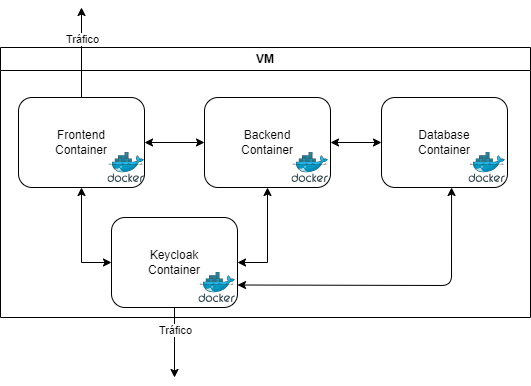

# Infraestrutura

## Design

De forma a manter todas as comunicações de forma privada para cumprir requisitos de segurança, foi adotada a estrutura demonstrada na imagem. É constituida por uma Máquina Virtual (VM), na qual estão presentes todos os containers e uma Reverse Proxy.

### VM

A VM está configurada de forma automática, isto querendo dizer que alguma coisa que aconteça à Máquina Virtual, é possível levantar uma com exatamente as mesmas configurações, utilizado IaC, mais especificamente, `Terraform`.

### Containers

Cada um dos container tem o seu respetivo Dockerfile, que será inicializado com o seu respetivo IP utilizado um `docker-compose.yml`. Apenas alguns serviços estão expostos para o tráfego de fora (Frontend e Keycloak) enquanto os restantes apenas estão expostos para outros serviços declarados no `docker-compose`.

Para os administradores conseguirem configurar a base de dados, têm que aceder à VM e a partir daí conseguem aplicar as mudanças desejadas. No caso dos utilizadores, apenas têm de acederem ao endereço da VM (<http://206.189.24.67:4200/>) para ter acesso à aplicação.
