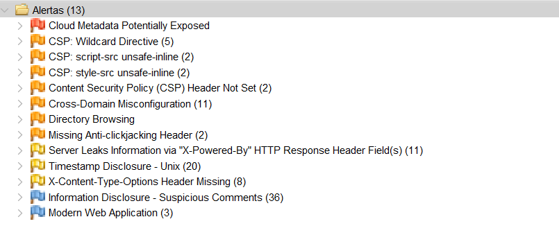

# OWASP ZAP (Zed Attack Proxy)

## Introdução
OWASP ZAP (Zed Attack Proxy) é uma das ferramentas mais populares e amplamente utilizadas para realizar testes de segurança em aplicações web. Desenvolvida pelo OWASP (Open Web Application Security Project), ZAP é uma ferramenta de código aberto que auxilia os desenvolvedores a encontrar vulnerabilidades de segurança nas suas aplicações web.

## Funcionalidades Principais
- **Proxy Interceptador:** Permite a inspeção e modificação do tráfego HTTP/HTTPS entre o navegador e a aplicação web.
- **Scan Passivo:** Analisa o tráfego da rede em busca de vulnerabilidades sem interagir diretamente com a aplicação.
- **Scan Ativo:** Realiza testes ativos na aplicação, como injeções SQL e testes de XSS, para identificar vulnerabilidades de segurança.
- **Ferramentas Integradas:** Inclui diversas ferramentas úteis como o Spider, Fuzzer, WebSocket Scanner, e muito mais.
- **Extensível:** Suporta plugins e scripts, permitindo a personalização e extensão das suas capacidades.

## Vantagens
- **Gratuito e de Código Aberto:** Acessível a todos e pode ser modificado conforme as necessidades específicas.
- **Facilidade de Uso:** Interface amigável e intuitiva, adequada tanto para iniciantes quanto para profissionais experientes.
- **Ampla Documentação:** Grande quantidade de recursos e tutoriais disponíveis para ajudar os utilizadores a maximizar o uso da ferramenta.

## Casos de Uso
- **Desenvolvimento Seguro:** Integrar ZAP no ciclo de desenvolvimento para identificar e corrigir vulnerabilidades antes da implementação.
- **Testes de Penetração:** Utilizado por profissionais de segurança para realizar avaliações de segurança em aplicações web.
- **Educação e Formação:** Ferramenta excelente para aprender sobre segurança web e práticas de testes de penetração.

# Análise realizada

| Alerta                                                   | Quantidade | Endereço Principal                           | Gravidade |
|----------------------------------------------------------|------------|----------------------------------------------|-----------|
| Cloud Metadata Potentially Exposed                       | 1          | http://206.189.24.67:4200/latest/meta-data/  | Alta      |
| CSP: Wildcard Directive                                  | 1          | http://206.189.24.67:4200                    | Média     |
| CSP: script-src unsafe-inline                            | 2          | http://206.189.24.67:9090/                   | Média     |
| CSP: style-src unsafe-inline                             | 2          | http://206.189.24.67:9090/                   | Média     |
| Content Security Policy (CSP) Header Not Set             | 2          | http://206.189.24.67:4200                    | Média     |
| Cross-Domain Misconfiguration                            | 11         | http://206.189.24.67:4200                    | Média     |
| Directory Browsing                                       | 1          | http://206.189.24.67:4200/vendor.js/         | Média     |
| Missing Anti-clickjacking Header                         | 2          | http://206.189.24.67:4200                    | Média     |
| Server Leaks Information via "X-Powered-By" Header       | 11         | http://206.189.24.67:4200                    | Média     |
| Timestamp Disclosure - Unix                              | 20         | http://206.189.24.67:4200/vendor.js          | Média     |
| X-Content-Type-Options Header Missing                    | 8          | http://206.189.24.67:4200                    | Média     |
| Information Disclosure - Suspicious Comments             | 36         | http://206.189.24.67:4200/main.js            | Baixa     |
| Modern Web Application                                   | 3          | http://206.189.24.67:4200                    | Baixa     |

## Print do ZAP

## Conclusão
OWASP ZAP é uma ferramenta essencial para qualquer profissional que pretenda garantir a segurança das suas aplicações web. Com a sua combinação de funcionalidades e facilidade de uso, é uma escolha excelente tanto para testes de segurança de rotina quanto para auditorias de segurança detalhadas.